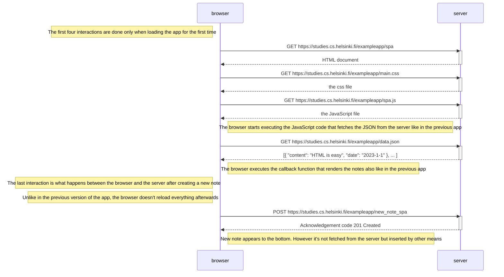

```mermaid
    sequenceDiagram
    participant browser
    participant server
    Note left of browser: The first four interactions are done only when loading the app for the first time
    browser->>server: GET https://studies.cs.helsinki.fi/exampleapp/spa
    activate server
    server-->>browser: HTML document
    deactivate server
    browser->>server: GET https://studies.cs.helsinki.fi/exampleapp/main.css
    activate server
    server-->>browser: the css file
    deactivate server
    browser->>server: GET https://studies.cs.helsinki.fi/exampleapp/spa.js
    activate server
    server-->>browser: the JavaScript file
    deactivate server
    Note right of browser: The browser starts executing the JavaScript code that fetches the JSON from the server like in the previous app
    browser->>server: GET https://studies.cs.helsinki.fi/exampleapp/data.json
    activate server
    server-->>browser: [{ "content": "HTML is easy", "date": "2023-1-1" }, ... ]
    deactivate server
    Note right of browser: The browser executes the callback function that renders the notes also like in the previous app 
    Note left of browser: The last interaction is what happens between the browser and the server after creating a new note
    Note left of browser: Unlike in the previous version of the app, the browser doesn't reload everything afterwards
    browser->>server: POST https://studies.cs.helsinki.fi/exampleapp/new_note_spa
    activate server
    server-->>browser: Acknowledgement code 201 Created
    deactivate server
    Note right of browser: New note appears to the bottom. However it's not fetched from the server but inserted by other means
```